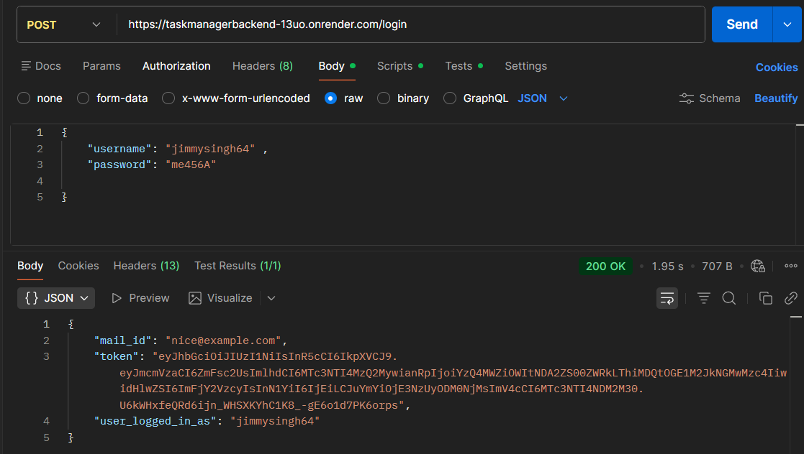
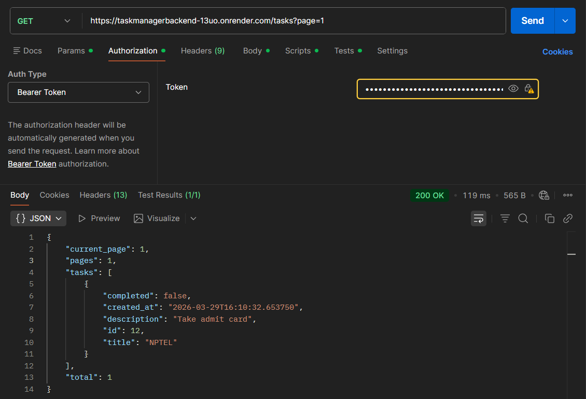
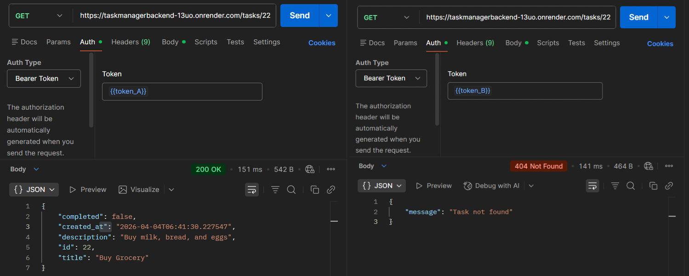
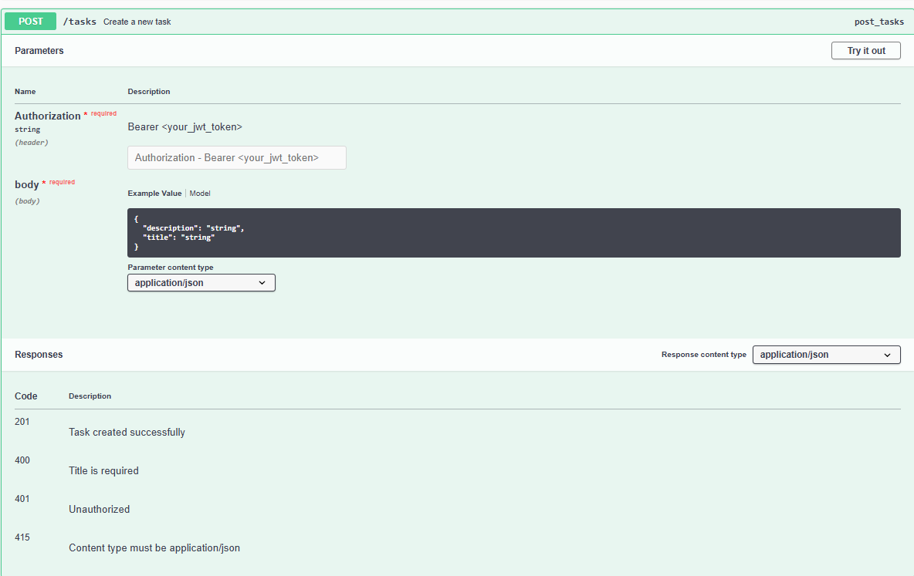

# Task Manager API

A secure, production-ready REST API for task management built with Flask and PostgreSQL.

This project goes beyond basic CRUD by focusing on security, ownership enforcement, and predictable API behavior.

---

## 🚀 Features

* JWT-based authentication
* Ownership-based access control (users can only access their own tasks)
* Full CRUD operations (Create, Read, Update, Delete)
* Pagination, filtering, and sorting
* Resource enumeration protection (returns 404 instead of 403)
* Consistent and meaningful HTTP status codes

---

## 🧱 Tech Stack

* **Backend:** Flask
* **Database:** PostgreSQL
* **ORM:** SQLAlchemy
* **Migrations:** Alembic
* **Authentication:** JWT
* **Server:** Gunicorn
* **Testing:** pytest

---

## 🧪 Engineering Practices

* App Factory pattern for scalable architecture
* Blueprints for modular route organization
* Isolated test database for safe testing
* Automated test suite using pytest
* Clean error handling and validation

---

## 🌐 Live Demo

- **Frontend (UI):** https://task-manager-api-rest-server.vercel.app
- **Backend API:** https://taskmanagerbackend-13uo.onrender.com  
- **Swagger Docs:** https://taskmanagerbackend-13uo.onrender.com/apidocs  

---

## 📸 API Preview

### 🔐 Authentication (JWT)

Login endpoint generating JWT token.



---

### 📋 Task Operations

Fetching tasks with pagination.



---

### 🔒 Security: Access Control

Cross-user access attempt returns **404 Not Found** instead of 403, preventing resource enumeration.



---

## 📄 API Documentation (Swagger)

Interactive API documentation:

https://taskmanagerbackend-13uo.onrender.com/apidocs



---


## 📦 API Overview

### Authentication

* `POST /auth/register` → Register a new user
* `POST /auth/login` → Login and receive JWT

### Tasks

* `POST /tasks` → Create a task
* `GET /tasks` → Get all tasks (supports pagination & filtering)
* `GET /tasks/<id>` → Get task by ID
* `PUT /tasks/<id>` → Update task
* `DELETE /tasks/<id>` → Delete task

---

## 🔐 Security Highlights

* JWT authentication for all protected routes
* Strict ownership checks on every resource
* Returns **404 Not Found** instead of **403 Forbidden** to prevent resource enumeration
* Handles invalid, expired, and malformed tokens gracefully

---

## ▶️ Running Locally

```bash
# Clone the repository
git clone https://github.com/jimmysinghx/task-manager-api.git
cd task-manager-api

# Create virtual environment
python -m venv venv
source venv/bin/activate  # Windows: venv\Scripts\activate

# Install dependencies
pip install -r requirements.txt

# Set environment variables
export FLASK_APP=run.py
export FLASK_ENV=development

# Run migrations
flask db upgrade

# Start server
flask run
```

---

## 🧪 Running Tests

```bash
pytest
```

---

## 📄 License

This project is open source and available under the MIT License.

---

## 👤 Author

**Jimmy Singh**

* GitHub: [https://github.com/jimmysinghx](https://github.com/jimmysinghx)

